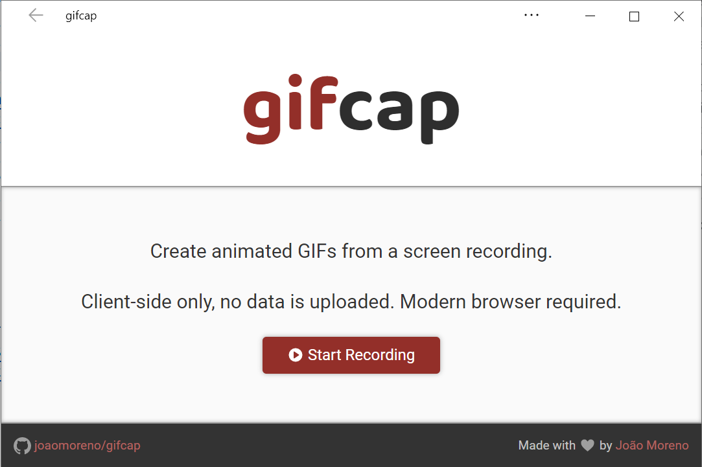

# gifcap

Record your screen into an animated GIF, all you need is a browser!

Try it now at [gifcap.dev](https://gifcap.dev/).

**Features:**

- No installations, no bloatware, no updates: this works in any modern browser, including Google Chrome, Firefox, Edge and Safari;
- No server side, everything is **100% client-side only**. All data stays in your machine, nothing gets uploaded to any server, the entire application is made of static files;
- PWA support makes it easy to add gifcap to your OS list of applications;
- Blazing fast GIF rendering powered by WASM, [libimagequant](https://github.com/ImageOptim/libimagequant) and [gifsicle](https://github.com/kohler/gifsicle);
- Highly optimized GIF file sizes, thanks to frame deduplication, boundary delta detection and lossy encoding;
- Entire screen recordings, or selection of single window;
- Intuitive trimming UI
- Easy cropping via visual drag-and-drop

---

**Wanna show your support?**

I do love coffee ☕: [`356S2FBHDwBUjki72KoForZ8YgYf4z3pFa`](bitcoin:356S2FBHDwBUjki72KoForZ8YgYf4z3pFa?label=gifcap&message=Thanks%20for%20making%20gifcap!).